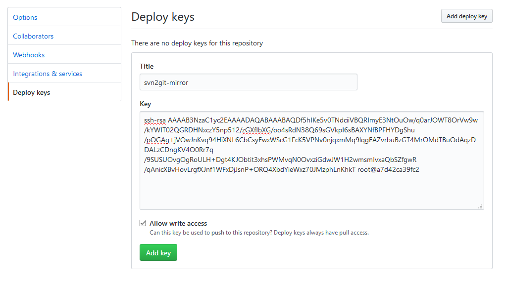

<p align="center"><a href="https://github.com/crazy-max/docker-svn2git-mirror" target="_blank"></a></p>

<p align="center">
  <a href="https://microbadger.com/images/crazymax/svn2git-mirror"></a>
  <a href="https://travis-ci.org/crazy-max/docker-svn2git-mirror"></a>
  <a href="https://hub.docker.com/r/crazymax/svn2git-mirror/"></a>
  <a href="https://hub.docker.com/r/crazymax/svn2git-mirror/"></a>
  <a href="https://quay.io/repository/crazymax/svn2git-mirror"></a>
  <a href="https://www.paypal.com/cgi-bin/webscr?cmd=_s-xclick&hosted_button_id=LHT63R3FN9WMN"></a>
</p>

## About

🐳 Docker image to mirror SVN repositories to Git periodically based on Alpine and [svn2git](https://github.com/nirvdrum/svn2git).

You can mirror multi SVN repositories through a configuration file (see below). When a repository is initialized, an SSH key is created. You will then only have to add the public key `id_rsa.pub` on the remote Git server to make the synchronization work.

The volume `/data` is mounted to persist SSH keys and repositories.

If you are interested, [check out](https://hub.docker.com/r/crazymax/) my other 🐳 Docker images!

## Configuration

This docker image works through a simple [config.json](asset/config.json) file :

* **id** : The name of the repository for example without special chars and spaces. **MUST BE UNIQUE**.
* **cron** : [Cron expression](https://crontab.guru/).
* **svn2git.repo** : SVN repo uri.
* **svn2git.username** : SVN repo username.
* **svn2git.password** : SVN repo password.
* **svn2git.options** : Options you can pass to [svn2git](https://github.com/nirvdrum/svn2git#options-reference) on init.
* **git.user** : Git server user (git).
* **git.repo** : Git repo to mirror with.
* **git.hostname** : Git server hostname.
* **git.port** : Git server SSH port.
* **authors** : List of authors to convert from SVN to Git format. More info [here](https://github.com/nirvdrum/svn2git#authors).

In the following example, trunk, branches and tags of SVN repository `https://svn.code.sf.net/p/ant-contrib/code/` will be synchronize with Git repository `github.com/crazy-max/ant-contrib` every **15 minutes** and some authors will be converted.  

```json
[
  {
    "id": "ant-contrib",
    "cron": "*/15 * * * *",
    "svn2git": {
      "repo": "https://svn.code.sf.net/p/ant-contrib/code/",
      "username": "",
      "password": "",
      "options": "--trunk ant-contrib/trunk --branches ant-contrib/branches --tags ant-contrib/tags"
    },
    "git": {
      "user": "git",
      "hostname": "github.com",
      "port": 22,
      "repo": "crazy-max/ant-contrib"
    },
    "authors": [
      {
        "svn": "bodewig",
        "git": "Stefan Bodewig <stefan.bodewig@freenet.de>"
      },
      {
        "svn": "carnold",
        "git": "carnold <carnold@apache.org>"
      }
    ]
  }
]
```

## Usage

Docker compose is the recommended way to run this image. You can use the following [docker compose template](docker-compose.yml), then run the container :

```bash
$ docker-compose up -d
```

Or use the following command :

```bash
$ docker run -d --name svn2git-mirror \
  -e TZ="Europe/Paris" \
  -v "$(pwd)/data:/data" \
  crazymax/svn2git-mirror:latest
```

## Extra

### Retrieve SVN authors

If you need a jump start on figuring out what users made changes in your svn repositories, you can use the following command based on the example below :

```
$ docker exec -i -t svn2git-mirror svn_authors id
bodewig
carnold
darius42
deanhiller
jonkri
mattinger
peterkittreilly
slip_stream
```

> Replace `id` to match an existing one in `config.json`.

### Retrieve the SSH public key

To retrieve the SSH public key `id_rsa.pub` to make the synchronization work on your Gitserver, enter the following command :

```
$ docker exec -i -t svn2git-mirror git_pubkey id
ssh-rsa AAAAB3NzaC1yc2EAAAADAQABAAABAQDf5hIKe5v0TNdciiVBQRImyE3NtOuOw/q0arJOWT8OrVw9w/kYWIT02QGRDHNxczY5np512/zGXfIbXG/oo4sRdN38Q69sGVkpI6sBAXYNfBPFHYDgShu/pOGAg+jVOwJnKvq94HiXNL6CbCsyEwxWScG1FcK5VPNv0njqxmMq9lqgEAZvrbuBzGT4MrOMdTBuOdAqzDDALzCDngKV4O0Rr7q/9SUSUOvgOgRoULH+Dgt4KJObtit3xhsPWMvqN0OvxziGdwJW1H2wmsmIvxaQbSZfgwR/qAnicXBvHovLrgfXJnf1WFxDjJsnP+ORQ4XbdYieWxz70JMzphLnKhkT root@a7d42ca39fc2
```

> Replace `id` to match an existing one in `config.json`.

### Mirroring with Github

To mirror with a [Github](https://github.com) repository, you have to use a [deploy key](https://developer.github.com/v3/guides/managing-deploy-keys/#deploy-keys) on the target Github repository :



> Do not forget to check **Allow write access**.

## How can i help ?

All kinds of contributions are welcomed :raised_hands:!<br />
The most basic way to show your support is to star :star2: the project, or to raise issues :speech_balloon:<br />
But we're not gonna lie to each other, I'd rather you buy me a beer or two :beers:!

[](https://www.paypal.com/cgi-bin/webscr?cmd=_s-xclick&hosted_button_id=LHT63R3FN9WMN)

## License

MIT. See `LICENSE` for more details.
